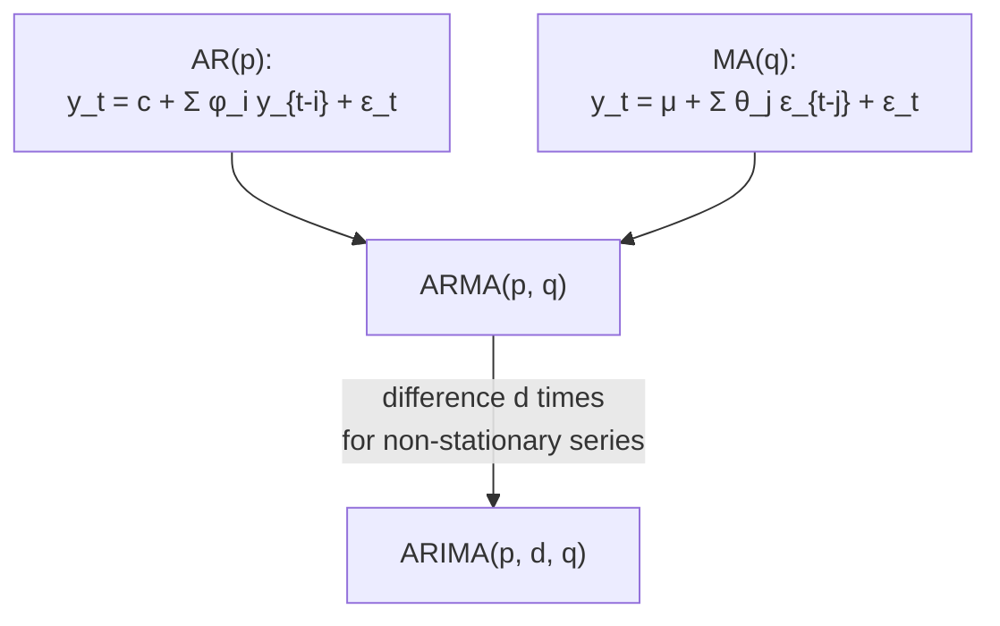

## AR, ARMA, ARIMA Models

Big picture (no jargon)

Three model families cover almost any single-variable time series:

- **AR(p)** — "today depends on the last $p$ values of *itself*" (auto-regression).
- **ARMA(p, q)** — combines AR's self-feedback with MA's recent-shock echo.
- **ARIMA(p, d, q)** — fits an ARMA to a series that has been **differenced $d$ times** to make it stationary. The "I" stands for *integrated*.

The standard workflow is the **Box–Jenkins method**: difference until stationary (fixes $d$), inspect ACF/PACF to identify $p$ and $q$, fit by MLE, check residuals, compare candidates with AIC/BIC.

**Real-world analogy.** Daily temperature: tomorrow strongly depends on today and the last few days (AR). Monthly retail sales: a holiday surprise three months ago might still be visibly above the average (MA). For most economic series, you difference once to remove the trend then fit ARMA on the differences — that's ARIMA.

### Vocabulary — every term, defined plainly

- **AR(p)** — autoregressive of order $p$: $y_t = c + \phi_1 y_{t-1} + \dots + \phi_p y_{t-p} + \varepsilon_t$.
- **MA(q)** — moving-average of order $q$ (covered last card).
- **ARMA(p, q)** — combination of AR(p) and MA(q).
- **ARIMA(p, d, q)** — ARMA(p, q) applied to $\nabla^d y_t$ (the $d$-th-order difference).
- **$\phi_i$** — AR coefficients (self-feedback weights).
- **$\theta_j$** — MA coefficients (shock weights).
- **$d$** — number of differences applied. Most series need $d = 0, 1$, or $2$.
- **Backshift operator $B$** — $B y_t = y_{t-1}$. Lets us write AR/MA polynomials compactly.
- **Characteristic polynomial / unit roots** — for AR(p), the polynomial $1 - \phi_1 z - \dots - \phi_p z^p$. Stationary iff all roots lie *outside* the unit circle ($|z| > 1$).
- **PACF (partial autocorrelation function)** — correlation between $y_t$ and $y_{t-k}$ *after removing* the linear effect of intermediate lags $y_{t-1}, \dots, y_{t-k+1}$.
- **Box–Jenkins method** — five-step workflow: identify, estimate, diagnose, refine, forecast.
- **Ljung–Box test** — checks whether residuals are white noise (no remaining autocorrelation).
- **AIC ($2k - 2\ln L$), BIC ($k \ln n - 2\ln L$)** — information criteria for model comparison; lower is better. BIC penalises complexity more strongly.

### Picture it — the family tree

### Build the idea — AR(p)

$$
y_t = c + \phi_1 y_{t-1} + \phi_2 y_{t-2} + \dots + \phi_p y_{t-p} + \varepsilon_t.
$$

In backshift notation:

$$
\phi(B)\, y_t = c + \varepsilon_t, \quad \text{where} \quad \phi(B) = 1 - \phi_1 B - \phi_2 B^2 - \dots - \phi_p B^p.
$$

**Stationarity condition.** Roots of $\phi(z) = 0$ must lie *outside* the unit circle. For AR(1): $|\phi_1| < 1$.

**Properties of AR(1) with $|\phi| < 1$:**

$$
E[y_t] = \frac{c}{1 - \phi}, \qquad \operatorname{Var}(y_t) = \frac{\sigma^2_\varepsilon}{1 - \phi^2}, \qquad \rho(k) = \phi^k.
$$

So the **ACF decays geometrically**, and the **PACF cuts off at lag 1**.

### Build the idea — ARMA(p, q)

$$
y_t = c + \sum_{i=1}^{p} \phi_i y_{t-i} + \varepsilon_t + \sum_{j=1}^{q} \theta_j \varepsilon_{t-j}.
$$

In backshift form:

$$
\phi(B)\, y_t = c + \theta(B)\, \varepsilon_t, \quad \theta(B) = 1 + \theta_1 B + \dots + \theta_q B^q.
$$

Stationary if AR roots are outside the unit circle. **Invertible** (a side condition for identifiability) if MA roots are also outside.

### Build the idea — ARIMA(p, d, q)

Difference the series $d$ times to stationarise, then fit ARMA(p, q):

$$
\nabla^d y_t \sim \text{ARMA}(p, q).
$$

After estimating, **integrate** ($d$-fold cumulative sum) to bring forecasts back to the original scale.

### Box–Jenkins identification — the ACF/PACF table

This table is the single most-tested concept in time series. **Memorise it.**

| Pattern | Suggests |
|---|---|
| ACF cuts off after lag $q$, PACF tails off | **MA($q$)** |
| PACF cuts off after lag $p$, ACF tails off | **AR($p$)** |
| Both tail off | **ARMA($p, q$)** |
| Slow linear-looking ACF decay | **Non-stationary** → difference more |

**Procedure.**

1. **Plot $y_t$.** Stationary? If not, difference until it is → that fixes $d$.
2. **Plot ACF & PACF** of the differenced series. Apply the table above to choose candidate $(p, q)$.
3. **Estimate** $\phi$, $\theta$ by MLE (most software defaults).
4. **Diagnose** residuals. They should be white noise. Use the Ljung–Box test ($H_0$: no autocorrelation) and an ACF plot of residuals.
5. **Compare** several candidate models with **AIC** or **BIC**; lowest wins.

### Information criteria

$$
\text{AIC} = 2k - 2 \ln L, \qquad \text{BIC} = k \ln n - 2 \ln L.
$$

$k$ = number of fitted parameters; $L$ = maximised likelihood; $n$ = sample size. Both balance fit (high $L$) against complexity (high $k$). BIC's $\ln n$ factor punishes complexity harder, especially for large $n$.

<dl class="symbols">
  <dt>$\phi_i$</dt><dd>AR coefficients</dd>
  <dt>$\theta_j$</dt><dd>MA coefficients</dd>
  <dt>$p, q$</dt><dd>orders of AR and MA components</dd>
  <dt>$d$</dt><dd>number of differences applied</dd>
  <dt>$B$</dt><dd>backshift operator, $B y_t = y_{t-1}$</dd>
  <dt>$\phi(B), \theta(B)$</dt><dd>AR / MA characteristic polynomials</dd>
  <dt>$L$</dt><dd>maximised likelihood</dd>
</dl>

### Worked example — fully expanded, no skipped arithmetic

Worked example: AR(1) properties

$y_t = 0.7\, y_{t-1} + \varepsilon_t$ with $\sigma^2_\varepsilon = 1$, $c = 0$.

**Step 1 — Stationarity.** $|\phi_1| = 0.7 < 1$ ✓. Equivalently, the root of $1 - 0.7 z = 0$ is $z = 1/0.7 \approx 1.43$, outside the unit circle.

**Step 2 — Mean.**

$$
E[y_t] = c/(1 - \phi) = 0/(1 - 0.7) = 0.
$$

**Step 3 — Variance.**

$$
\operatorname{Var}(y_t) = \sigma^2_\varepsilon / (1 - \phi^2) = 1 / (1 - 0.49) = 1/0.51 \approx 1.961.
$$

**Step 4 — ACF.** $\rho(k) = \phi^k = 0.7^k$:

| $k$ | $\rho(k)$ |
|---|---|
| 0 | 1.000 |
| 1 | 0.700 |
| 2 | 0.490 |
| 3 | 0.343 |
| 4 | 0.240 |
| 5 | 0.168 |

**Geometric decay.** Sample ACF would show this curve decaying smoothly toward zero.

**Step 5 — PACF.** PACF($k = 1$) $= 0.7$, PACF($k \ge 2$) $= 0$. **Cuts off at lag 1** — the signature of AR(1).

**Step 6 — Diagnostic.** "ACF decays geometrically, PACF cuts off at lag 1" → identify as AR(1). ✓

### How to think about it

Mental model — feedback vs echoes

- **AR(p)** = "today is mostly a function of recent yesterdays". Self-feedback creates *persistent* memory — ACF decays slowly because each value influences all future values, transitively.
- **MA(q)** = "today is mostly a function of recent surprises". Shocks have a *finite* lifespan of $q$ steps — ACF cuts off.
- **ARMA** = both mechanisms together.
- **ARIMA** = ARMA on a *transformed* series that's been made stationary by differencing.

**Why does PACF reveal AR order?** PACF "kills the chain effect" — it removes the indirect influence through intermediate lags and reveals only the *direct* dependency. AR(p) has direct dependencies only at lags $1$ through $p$; beyond $p$, all influence is through intermediate steps, so PACF is zero.

**When this comes up in ML.** Classical forecasting (stocks, sales, demand, server load). Modern recurrent and convolutional models (TCNs, Temporal Fusion Transformers) generalise these ideas. The auto-correlation diagnostic is reused in residual checking for any sequential model.

Watch out — common traps

- **Over-differencing** introduces unnecessary noise (artificial MA structure). Use the **ADF test** to confirm stationarity rather than reflexively differencing.
- A model with **non-white residuals is wrong** — return to step 2 and re-identify.
- **$\phi$ near 1** indicates a **unit root** — use ARIMA, not ARMA.
- **AR and MA representations can mimic each other** in finite samples (any stationary AR(1) can be written as an MA($\infty$)). The PACF/ACF table is your guide; AIC/BIC tie-break.
- **Seasonal patterns** require seasonal extensions (SARIMA, next card). Vanilla ARIMA misses them.
- **Integrated forecasts widen** with horizon — confidence bands grow because uncertainty compounds across steps.
- **Look at the sign of $\theta$ and $\phi$** carefully — software conventions sometimes flip the sign of $\theta$.

Exam tip

Memorise the ACF/PACF identification table — it's worth easy marks every exam. For a numerical AR(1) question, compute mean, variance, and a few ACF values using $\rho(k) = \phi^k$. For "what model would you fit?", state $(p, d, q)$ explicitly and justify by referencing the ACF/PACF pattern. AIC < BIC for picking richer models; BIC < AIC for parsimony.

