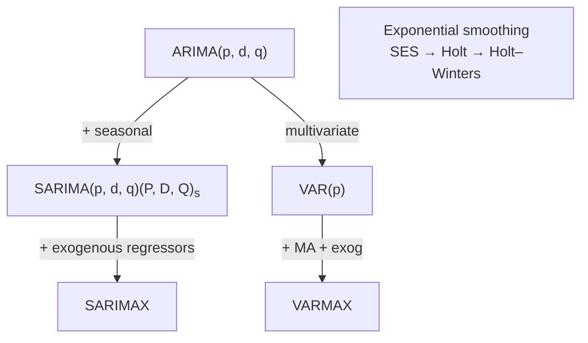
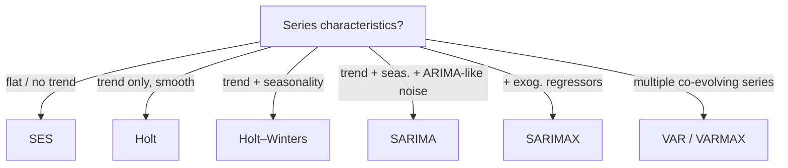

## SARIMA, SARIMAX, VAR, VARMAX, Exponential Smoothing

Big picture (no jargon)

ARIMA only handles **univariate, non-seasonal** data. Real series often have:

- **Seasonality** (weekly, monthly, yearly) → **SARIMA**.
- **Helpful external regressors** (holidays, ad spend) → add an "X" → **SARIMAX**.
- **Multiple co-evolving series** → **VAR / VARMAX**.
- A simpler, more robust alternative for short-horizon forecasting → **Exponential Smoothing** (SES, Holt, Holt–Winters / ETS).

The job of this card is to help you pick the right model for the data in front of you.

**Real-world analogy.** Monthly air-passenger traffic has a clear yearly cycle on top of an upward trend → SARIMA. Adding "holiday week yes/no" makes it SARIMAX. GDP and unemployment move together over time → VAR. A simple weekly demand forecast for a small store is often best served by Holt–Winters.

### Vocabulary — every term, defined plainly

- **SARIMA(p, d, q)(P, D, Q)$_s$** — Seasonal ARIMA: regular ARIMA + seasonal AR, differencing, MA at lag $s$.
- **$s$** — seasonal period (12 for monthly with yearly seasonality, 7 for daily with weekly, 4 for quarterly with yearly).
- **$P, D, Q$** — seasonal AR order, seasonal differencing order, seasonal MA order.
- **$\nabla_s = 1 - B^s$** — seasonal differencing operator: $\nabla_s y_t = y_t - y_{t-s}$.
- **SARIMAX** — SARIMA + a matrix $X_t$ of exogenous regressors entering the equation linearly.
- **VAR(p) (Vector AutoRegression)** — multivariate AR: each variable depends on its own and the others' past values.
- **VARMAX** — VAR + MA terms + exogenous regressors. The most general member of the family.
- **Exponential Smoothing / ETS** — recursive forecasting using *exponentially decaying* weights on past observations.
- **SES (Simple Exponential Smoothing)** — captures level only.
- **Holt's method** — captures level + trend.
- **Holt–Winters** — captures level + trend + seasonality (additive or multiplicative).
- **Smoothing parameters $\alpha, \beta, \gamma$** — controls how fast the level / trend / seasonal estimates respond to new observations; each in $[0, 1]$.

### Picture it — the family map

### Build the idea — SARIMA

The full backshift form:

$$
\Phi_P(B^s)\, \phi_p(B)\, \nabla^d \nabla_s^D\, y_t \;=\; \Theta_Q(B^s)\, \theta_q(B)\, \varepsilon_t,
$$

where $\phi_p, \theta_q$ are the regular AR/MA polynomials in $B$ and $\Phi_P, \Theta_Q$ are the seasonal AR/MA polynomials in $B^s$.

**Reading the orders.**

- $(p, d, q)$ = short-term (regular) structure.
- $(P, D, Q)$ = season-over-season structure (correlations across years if $s = 12$).
- $s$ = season length.

**SARIMAX** simply adds $\sum_k \beta_k X_{k,t}$ on the right-hand side, treating the regressors as known covariates.

### Build the idea — VAR(p)

For $k$-dimensional series $\mathbf y_t \in \mathbb R^k$:

$$
\mathbf y_t = \mathbf c + A_1 \mathbf y_{t-1} + A_2 \mathbf y_{t-2} + \dots + A_p \mathbf y_{t-p} + \boldsymbol\varepsilon_t,
$$

where each $A_i$ is a $k \times k$ matrix of coefficients. Each variable depends on its own lags **and** the lags of all the others — captures **mutual influence**. **VARMAX** generalises by adding MA terms and exogenous regressors.

**Stationarity** requires roots of $\det(I - A_1 z - \dots - A_p z^p) = 0$ to lie outside the unit circle.

### Build the idea — Exponential smoothing (ETS family)

| Method | Captures | Recursive update |
|---|---|---|
| **SES (Simple)** | Level only | $\ell_t = \alpha y_t + (1 - \alpha)\ell_{t-1}$ |
| **Holt's** | Level + trend | $\ell_t = \alpha y_t + (1 - \alpha)(\ell_{t-1} + b_{t-1})$, $b_t = \beta(\ell_t - \ell_{t-1}) + (1 - \beta)b_{t-1}$ |
| **Holt–Winters (additive)** | Level + trend + seasonality | adds $s_t = \gamma(y_t - \ell_{t-1} - b_{t-1}) + (1 - \gamma)s_{t-s}$ |

**Forecast (Holt–Winters additive):**

$$
\hat y_{t+h} = \ell_t + h\, b_t + s_{t+h-s\lceil h/s \rceil}.
$$

**Multiplicative seasonal variant** uses $y_t / s_{t-s}$ in the level update and multiplies by $s_{t+h-s\lceil h/s\rceil}$ in the forecast — pick this when the seasonal swings *grow with the level*.

**ETS notation** (used in `forecast`/`statsmodels`): $\text{ETS}(E, T, S)$ with each component being None ($N$), Additive ($A$), Multiplicative ($M$), or damped ($A_d$).

### Picking a model — quick decision tree

<dl class="symbols">
  <dt>$s$</dt><dd>seasonal period</dd>
  <dt>$P, D, Q$</dt><dd>seasonal AR / differencing / MA orders</dd>
  <dt>$\nabla_s$</dt><dd>seasonal differencing $1 - B^s$</dd>
  <dt>$X_t$</dt><dd>vector of exogenous regressors at time $t$</dd>
  <dt>$\mathbf y_t$</dt><dd>multivariate observation in VAR</dd>
  <dt>$A_i$</dt><dd>$k \times k$ VAR coefficient matrix at lag $i$</dd>
  <dt>$\alpha, \beta, \gamma$</dt><dd>smoothing parameters for level / trend / seasonality</dd>
  <dt>$\ell_t, b_t, s_t$</dt><dd>level, trend, seasonal components</dd>
</dl>

### Worked example — fully expanded, no skipped arithmetic

Worked example: monthly airline passengers — the "airline model"

Box & Jenkins's classic series: monthly international airline passengers, 1949–1960. Two clear features:

1. **Upward trend** (post-war air travel boom).
2. **Yearly seasonality** with peaks in summer.

Variance also grows with the level → log-transform first.

**Identification.**

- Trend present → regular differencing $d = 1$ ($\nabla y_t$).
- Yearly seasonality with $s = 12$ → seasonal differencing $D = 1$ ($\nabla_{12} y_t$).
- After both differences, the residual ACF/PACF suggest MA(1) at lag 1 and seasonal MA(1) at lag 12 → $q = 1$, $Q = 1$, $p = P = 0$.

**Final model:** SARIMA(0, 1, 1)(0, 1, 1)$_{12}$ on $\log y_t$ — the famous "airline model".

**Backshift form:**

$$
(1 - B)(1 - B^{12})\, \log y_t = (1 + \theta_1 B)(1 + \Theta_1 B^{12})\, \varepsilon_t.
$$

**Worked SES one-step example.**

Time-series sales: $y_1, \dots, y_5 = 100, 105, 110, 108, 112$. SES with $\alpha = 0.5$, initial $\ell_0 = y_1 = 100$.

$\ell_1 = 0.5 \cdot 100 + 0.5 \cdot 100 = 100$.
$\ell_2 = 0.5 \cdot 105 + 0.5 \cdot 100 = 102.5$.
$\ell_3 = 0.5 \cdot 110 + 0.5 \cdot 102.5 = 106.25$.
$\ell_4 = 0.5 \cdot 108 + 0.5 \cdot 106.25 = 107.125$.
$\ell_5 = 0.5 \cdot 112 + 0.5 \cdot 107.125 = 109.5625$.

Forecast for $t = 6$: $\hat y_6 = \ell_5 = 109.56$.

**Higher $\alpha$** = more responsive to recent observations (less smoothing). **Lower $\alpha$** = smoother but slower to react to changes.

### How to think about it

Mental model

- **SARIMA** = ARIMA "stamped" twice — once at lag 1 (short-term dynamics) and once at lag $s$ (year-over-year dynamics).
- **SARIMAX** = SARIMA + "by the way, also depends on these known external variables".
- **VAR** = many ARs of each variable on each other — pick this when variables drive *each other* (GDP ↔ unemployment, electricity demand ↔ temperature).
- **Exponential smoothing** = a weighted average of the past where weights decay geometrically with age. Simple, robust, and frequently *outperforms* ARIMA at short horizons because it has fewer parameters to overfit.

**When this comes up in ML.** SARIMA / SARIMAX dominate classical demand and energy forecasting. ETS is the default baseline in many forecasting competitions and is what powers Facebook's Prophet (which adds Bayesian flavour). VAR is the workhorse of macro-econometrics. Modern deep models (DeepAR, Temporal Fusion Transformers, N-BEATS) generalise the same ideas.

Watch out — common traps

- **VAR is data-hungry** — number of parameters grows like $k^2 p$. With many series and few observations, you'll overfit; consider Bayesian VAR or sparse alternatives.
- **SARIMAX requires future values of $X_t$** at prediction time. Either they must be deterministic (calendars, holidays) or you must forecast them too.
- **Holt–Winters additive vs multiplicative** — pick by whether the seasonal swings are roughly constant in magnitude (additive) or scale with the level (multiplicative). Plot first; choose later.
- **Don't double-count seasonality.** If you've seasonally differenced ($D = 1$), you typically don't also need a non-zero $P$.
- **Damped trend** ($\phi < 1$ in Holt's damped variant) often produces more realistic long-horizon forecasts than the standard linear trend, which extrapolates indefinitely.
- **Initialisation matters** for ETS — different software choices for $\ell_0, b_0, s_0$ can give different forecasts on short series.
- **Stationarity & invertibility constraints** apply to *both* the seasonal and non-seasonal polynomials in SARIMA.

Exam tip

Be ready to (a) state when SARIMA beats ARIMA — *presence of seasonality*, (b) interpret all six SARIMA orders in plain English, (c) explain when you'd reach for VAR vs separate ARIMAs — *when variables are mutually predictive*, (d) write the SES recursion. Memorise the additive Holt–Winters update equations as a triple — level, trend, season — and the forecast formula.

