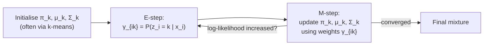

## Gaussian Mixture Models & EM Algorithm

Big picture (no jargon)

A **Gaussian Mixture Model (GMM)** describes data as having been *secretly generated* from $K$ different Gaussian "blobs" — but you don't know which blob each point came from, and you don't know the blobs' means/covariances either. The model is a **soft clustering** tool: every point gets a *probability* of belonging to each blob, not a hard assignment.

The **EM algorithm** is the workhorse for fitting GMMs (and many other latent-variable models). It alternates two steps:

- **E-step:** *guess* the soft cluster assignments using current parameters.
- **M-step:** *update* the parameters using those weighted assignments.

Each iteration is guaranteed to increase (or hold steady) the log-likelihood, so it eventually converges. It's a beautifully self-bootstrapping idea — a chicken-and-egg solver.

**Real-world analogy.** You photograph a flock at dusk. You suspect it's a mix of two species. You don't know which bird is which, and you don't know the average wingspan of either species. EM says: *guess* the species probabilities (E), then re-estimate average wingspans weighted by your guesses (M); repeat until the answers stop changing.

### Vocabulary — every term, defined plainly

- **Mixture model** — distribution that's a weighted sum of "component" distributions: $p(x) = \sum_k \pi_k\, p_k(x)$.
- **Gaussian mixture** — each component is a Gaussian: $p_k(x) = \mathcal{N}(x; \mu_k, \Sigma_k)$.
- **Mixing weights $\pi_k$** — prior probability of component $k$. Constrained: $\pi_k \ge 0$, $\sum_k \pi_k = 1$.
- **Latent variable $z_i$** — *unobserved* indicator of which component generated point $\mathbf x_i$. Discrete, takes values in $\{1, \dots, K\}$.
- **Responsibility $\gamma_{ik}$** — posterior probability that component $k$ generated point $i$, given the current parameters. A *soft* assignment in $[0, 1]$.
- **E-step (Expectation)** — compute responsibilities $\gamma_{ik}$ holding parameters fixed.
- **M-step (Maximisation)** — update parameters $(\pi_k, \mu_k, \Sigma_k)$ holding responsibilities fixed.
- **Effective count $N_k = \sum_i \gamma_{ik}$** — total responsibility mass for component $k$; the "soft sample size" of cluster $k$.
- **Log-likelihood $\log p(\mathbf X)$** — what EM monotonically increases.
- **ELBO (Evidence Lower BOund)** — $\sum_i \mathbb E_{q(z_i)}[\log p(\mathbf x_i, z_i)] - \mathbb E_{q(z_i)}[\log q(z_i)]$. EM does coordinate-ascent on this.
- **Local optimum** — EM only guarantees a local maximum of log-likelihood; **initialisation matters**.

### Picture it

### Build the idea — the model

$$
p(\mathbf x) \;=\; \sum_{k=1}^{K} \pi_k\; \mathcal{N}(\mathbf x;\, \boldsymbol\mu_k,\, \Sigma_k), \qquad \sum_{k=1}^{K} \pi_k = 1, \quad \pi_k \ge 0.
$$

Each Gaussian component:

$$
\mathcal{N}(\mathbf x;\, \boldsymbol\mu_k, \Sigma_k) = \frac{1}{(2\pi)^{d/2} |\Sigma_k|^{1/2}} \exp\!\left( -\tfrac{1}{2}(\mathbf x - \boldsymbol\mu_k)^\top \Sigma_k^{-1} (\mathbf x - \boldsymbol\mu_k) \right).
$$

For $n$ observations, the log-likelihood (what EM increases):

$$
\log p(\mathbf X \mid \boldsymbol\theta) = \sum_{i=1}^{n} \log\!\left( \sum_{k=1}^{K} \pi_k\, \mathcal{N}(\mathbf x_i; \boldsymbol\mu_k, \Sigma_k) \right).
$$

Because of the inner sum, this is *not* concave in $(\pi, \mu, \Sigma)$ — there's no closed-form maximiser. That's why we need EM.

### Build the idea — EM algorithm

**E-step.** For each point $i$ and component $k$, compute the responsibility:

$$
\gamma_{ik} \;=\; \frac{\pi_k\, \mathcal{N}(\mathbf x_i;\, \boldsymbol\mu_k, \Sigma_k)}{\displaystyle \sum_{j=1}^{K} \pi_j\, \mathcal{N}(\mathbf x_i;\, \boldsymbol\mu_j, \Sigma_j)}.
$$

By construction $\sum_k \gamma_{ik} = 1$ for each point.

**M-step.** Define the **effective count** $N_k = \sum_i \gamma_{ik}$. Update parameters using the responsibility-weighted statistics:

$$
\pi_k = \frac{N_k}{n}, \qquad \boldsymbol\mu_k = \frac{1}{N_k}\sum_i \gamma_{ik}\, \mathbf x_i,
$$

$$
\Sigma_k = \frac{1}{N_k}\sum_i \gamma_{ik}\, (\mathbf x_i - \boldsymbol\mu_k)(\mathbf x_i - \boldsymbol\mu_k)^\top.
$$

**Iterate.** Repeat E-then-M until the log-likelihood change is below a small threshold (e.g. $10^{-4}$).

### Build the idea — why EM works (the ELBO view)

For any distribution $q(\mathbf z)$ over the latent variables, the log-likelihood decomposes as:

$$
\log p(\mathbf x) \;=\; \underbrace{\mathbb E_{q}[\log p(\mathbf x, \mathbf z)] - \mathbb E_{q}[\log q(\mathbf z)]}_{\text{ELBO}(q,\, \theta)} \;+\; \operatorname{KL}\!\left(q(\mathbf z)\,\|\,p(\mathbf z \mid \mathbf x)\right).
$$

Because KL $\ge 0$, the ELBO lower-bounds $\log p(\mathbf x)$.

- **E-step** maximises the ELBO over $q$ by setting $q = p(\mathbf z \mid \mathbf x)$ (then KL $= 0$ and ELBO equals the log-likelihood).
- **M-step** maximises the ELBO over $\theta$ holding $q$ fixed.

Coordinate ascent on the ELBO never decreases it → log-likelihood is non-decreasing.

### GMM vs k-means

| | k-means | GMM |
|---|---|---|
| Assignment | Hard (one cluster per point) | Soft (probabilities over clusters) |
| Cluster shape | Spherical (Euclidean) | Ellipsoidal (any $\Sigma_k$) |
| Distance metric | Euclidean | Mahalanobis (under each $\Sigma_k$) |
| Special case | Limit of GMM with $\Sigma_k = \sigma^2 I$ as $\sigma \to 0$ + hard E-step | — |
| Output | Cluster labels | Labels + uncertainty + density estimate |

<dl class="symbols">
  <dt>$K$</dt><dd>number of mixture components (chosen by user)</dd>
  <dt>$\pi_k$</dt><dd>mixing weight (prior) of component $k$</dd>
  <dt>$\boldsymbol\mu_k, \Sigma_k$</dt><dd>mean vector and covariance matrix of component $k$</dd>
  <dt>$z_i$</dt><dd>latent component index for point $i$ (never observed)</dd>
  <dt>$\gamma_{ik}$</dt><dd>responsibility — posterior $P(z_i = k \mid \mathbf x_i)$</dd>
  <dt>$N_k = \sum_i \gamma_{ik}$</dt><dd>effective sample count attributed to component $k$</dd>
  <dt>$d$</dt><dd>dimension of the data</dd>
</dl>

### Worked example — fully expanded, no skipped arithmetic

Worked example: 1-D GMM, one EM iteration

Data: $\mathbf x = \{0, 1, 5, 6\}$. $K = 2$. Initialise $\mu_1 = 0, \mu_2 = 5$, $\sigma_1 = \sigma_2 = 1$ (so $\Sigma_k = 1$), $\pi_1 = \pi_2 = 0.5$.

**E-step.** Compute Gaussian densities $\phi(x; \mu, 1) = \frac{1}{\sqrt{2\pi}} e^{-(x-\mu)^2/2}$. With $1/\sqrt{2\pi} \approx 0.3989$:

| $x$ | $\phi(x; 0, 1)$ | $\phi(x; 5, 1)$ |
|---|---|---|
| 0 | $0.3989$ | $0.3989\,e^{-12.5} \approx 1.49\!\times\!10^{-6}$ |
| 1 | $0.3989\,e^{-0.5} \approx 0.2420$ | $0.3989\,e^{-8} \approx 1.34\!\times\!10^{-4}$ |
| 5 | $\approx 1.49\!\times\!10^{-6}$ | $0.3989$ |
| 6 | $\approx 1.34\!\times\!10^{-4}$ | $0.2420$ |

Responsibilities (numerator $\pi_k \phi$, divide by sum across $k$ — both $\pi_k = 0.5$ cancel):

| $x$ | $\gamma_1$ | $\gamma_2$ |
|---|---|---|
| 0 | $\approx 1.000$ | $\approx 0.000$ |
| 1 | $\approx 0.9994$ | $\approx 0.0006$ |
| 5 | $\approx 0.000$ | $\approx 1.000$ |
| 6 | $\approx 0.0006$ | $\approx 0.9994$ |

**M-step.** Effective counts:

$$
N_1 \approx 1.000 + 0.9994 + 0.000 + 0.0006 = 2.000, \qquad N_2 \approx 2.000.
$$

New mixing weights: $\pi_1 = \pi_2 = 2/4 = 0.5$ (unchanged).

New means:

$$
\mu_1 = \frac{1.000 \cdot 0 + 0.9994 \cdot 1 + 0.000 \cdot 5 + 0.0006 \cdot 6}{2.000} = \frac{0 + 0.9994 + 0 + 0.0036}{2.000} \approx 0.5015.
$$

$$
\mu_2 = \frac{0.000 \cdot 0 + 0.0006 \cdot 1 + 1.000 \cdot 5 + 0.9994 \cdot 6}{2.000} = \frac{0 + 0.0006 + 5 + 5.9964}{2.000} \approx 5.4985.
$$

New variances (using new means, weighted squared deviations divided by $N_k$):

$$
\sigma_1^2 = \frac{1.000(0 - 0.5015)^2 + 0.9994(1 - 0.5015)^2 + \dots}{2.000} \approx 0.250.
$$

By symmetry, $\sigma_2^2 \approx 0.250$.

**Result after one iteration.** $\mu_1 \approx 0.5$, $\mu_2 \approx 5.5$ — exactly the cluster centres we'd expect ($\{0, 1\}$ and $\{5, 6\}$). The log-likelihood will continue to nudge upward over a few more iterations; convergence is fast for well-separated data.

### How to think about it

Mental model — chicken-and-egg solver

If you knew the cluster assignments, fitting Gaussians is trivial — just compute means and covariances of each cluster. If you knew the Gaussians, computing soft assignments is trivial — just evaluate Bayes' rule per point. EM alternates these two trivial sub-problems and provably never makes things worse.

GMM is "soft k-means with elliptical clusters". When you set $\Sigma_k = \sigma^2 I$ for all $k$ and let $\sigma \to 0$ while doing hard assignments, you literally recover k-means. So everything you know about k-means transfers, with the bonus that GMM also gives you (a) uncertainty per point, (b) cluster shape (covariance), and (c) a proper density model $p(\mathbf x)$.

**When this comes up in ML.** Soft clustering and density estimation. Speaker / phoneme modelling in classical speech recognition. Background subtraction in computer vision (per-pixel GMM). Initialisation of more complex models (HMMs, VAE priors). The EM idea generalises far beyond GMMs — Hidden Markov Models, mixture of experts, latent Dirichlet allocation, missing-data imputation all use EM.

Watch out — common traps

- **EM is only locally optimal.** Initialisation matters enormously. Standard practice: run multiple restarts with k-means++ initialisation and pick the highest log-likelihood.
- **Singularity / degenerate components.** A Gaussian centred exactly on one data point with $\Sigma_k \to 0$ has likelihood $\to \infty$. Always add a small **regulariser** to $\Sigma_k$ (e.g. $\Sigma_k \leftarrow \Sigma_k + \lambda I$) or use a Bayesian (Wishart) prior.
- **Choosing $K$.** Log-likelihood always improves as $K$ grows — don't pick $K$ that way. Use **BIC, AIC, or held-out log-likelihood** instead, or domain knowledge.
- **Label switching.** GMMs are unidentifiable up to permutations of components. Don't try to interpret "component 1" as a stable thing across runs.
- **Covariance type matters.** Full vs diagonal vs spherical $\Sigma_k$ trade flexibility against parameter count. For high-dimensional data, prefer diagonal or tied covariances.
- **Convergence is in log-likelihood, not parameters.** Monitor $\Delta \log L < \epsilon$ as your stopping criterion.
- **Don't confuse responsibility with hard label.** Always report $\gamma_{ik}$ if you can; collapsing to argmax discards uncertainty.

Exam tip

Be able to write the E-step and M-step formulas from memory, including the responsibility expression with normalising denominator. State that the **log-likelihood is monotonically non-decreasing** under EM and explain *why* via the ELBO decomposition. The one-liner intuition "**GMM = soft k-means with elliptical clusters and uncertainty**" earns easy marks.

